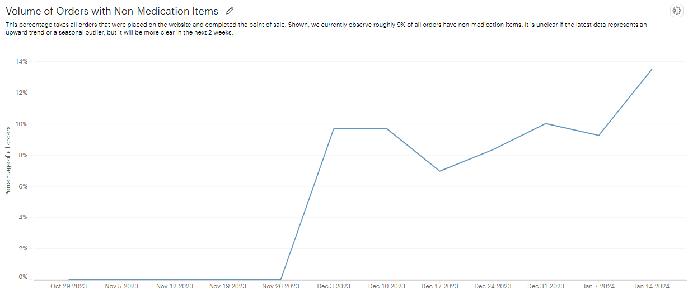
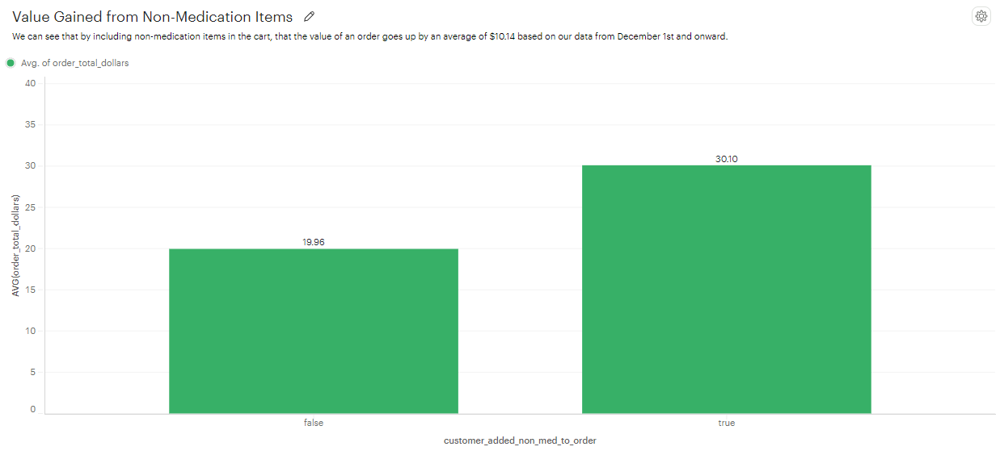

# Abstract

This portfolio piece features a non-technical report for a sales experiment of a fictional drug Claridryl, named after an Adult Swim commercial. The report is written in the context that the current data is in the present time, with the proposed experiment being in the future and requiring that future data to validate its outcome. The query format is reusable specifically to validate the experiment after it is run again in the future.

The queries used to generate the report is within `/sql/` folder. Additional technical images not included in the report can be found within `/vignettes/` and contains visual representations of other valuable insights such as the normality/heteroscedasticity of the data. Finally, the `/img/` folder contains both a screenshot of the sample data as well as report images.

# Exploratory Data and Design

On December, the company rolled out a feature to promote the sales of non-medication items through the online website purchase. We began to quantify the sales volume and found that roughly 9% of sales includes non-medication. The company now intends to update the website view to promote more sales to a target goal of 20%. This calls for an A/B test where we will see if sales volume increases after the website is updated.

# Base Statistics

Our company website served 7000 orders in the past two months and delivered medication to our customers. It is also notable that 452 of those orders were canceled after checkout from the website. For our experiment, we will assume that the cancelations are due to factors unrelated to the website such as delivery delays and customer behavior. Furthermore, our dataset for consideration will only include orders made after December 1st, when the feature was released and the non-medication orders began tracking. This results in a total of 4186 real orders for analysis.

In general, the inclusion of non-medications increases the financial value of the order. Roughly 9% of our sales currently include non-medication items and the average sale of an individual order with non-meds is worth $10, so we can get a rough estimate. Since we had $58,640 in sales volume in December, we can assume that non-medication items contributed $5,280 in the sales total. The initiative to get this sales volume to 20% means that the initiative intends to double in value to an additional $6,450 for a monthly total of $11,730 in non-medication goods.

In summary, the February 2024 initiative projects an increase in yearly sales of $77,400 in non-medication goods if we reach the 20% threshold from our original 9% records.

# Experiment Design

We are looking for an A/B test between the current version of the website and the new version of this display. A successful A/B test will mean getting a suitable number of visitors to get a reliable normal distribution, determining the appropriate duration before beginning, and passing a majority (2/3) of our data metrics. Our alpha value will be 90% and will be fixed before experiment begins. One major assumption being used in this experiment design is that the data follows a normal distribution.

In the past, we have serviced thousands of orders per month and most of our customers put in around two to three orders in a quarter year. It should therefore be sufficiently easy to acquire 400 orders from 200 customers for our experiment. It would be particularly valuable if we got our existing customers as well as new ones, but this distinction will not be necessary.

Next, our control population will be from the three weeks between 12-28-2023 and 1-18-2024 because our data was highly regular based on the upcoming metrics we will be using. This range was chosen based on a three week duration for this A/B test, but it can be adjusted for the company's needs, like if there is a need for multivariate testing.

## Metrics

Now, the hard part is choosing the metrics. We will be looking at three major metrics to determine the success of the project.

First, we will observe the percentage of orders that include non-medication and if it exceeds at least two standard deviations from the test data, then it will pass. This translates to at least 16% of orders must include non-medications.

Second, we will observe the average value of orders from the control group to the new data to see if the value of orders changes. While it is not necessary to increase, it is important that it shouldn't decrease by more than two standard deviations. So it shouldn't go down from $30 to $26.

Finally, we will observe the number of cancelations to make sure that people are not giving up at checkout time from the new website design. By the two standard deviations, this means cancelations should not exceed 50 total.

Overall, it is necessary that the first metric is met since that is a hard goal for our experiment, but we must also qualify for at least one of the two other metrics. Cheers.
